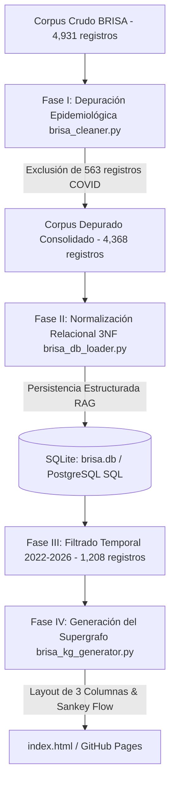

# UniTES 

## BRISA-KG

Este repositorio contiene el sistema de ingeniería de datos y visualización interactiva desarrollado bajo el marco institucional de UniTES (Facultad de Medicina, UNMdP). El objetivo del proyecto es la consolidación, normalización y análisis relacional del corpus de la Base Regional de Informes de Evaluación de Tecnologías en Salud de las Américas (BRISA) para el periodo 2022-2026.

---

### 1. Resumen Metodológico del Proceso

El desarrollo de este sistema de visualización y persistencia estructurada se dividió en cuatro fases:



---

### 2. Fase I: Depuración Epidemiológica y Criterios de Exclusión

#### Justificación
Durante el periodo 2020-2022, la producción científica y los informes de evaluación de tecnologías sanitarias (ETS) presentaron una elevada concentración de registros dedicados a la COVID-19 y la infección por SARS-CoV-2. Para realizar un análisis estructural de la agenda de investigación en salud convencional (patologías oncológicas, cardiovasculares, neurológicas y crónicas), se buscó aislar la distorsión generada por la concentración de publicaciones sobre dicha patología.

#### Algoritmo de Exclusión Selectiva
El script [brisa_cleaner.py](file:///c:/Users/jsanc/Proyectos%20IA/Brisa_grafo_RAG/brisa_cleaner.py) aplicó expresiones regulares compuestas en los campos de Título, Resumen/Abstract, Palabras Clave y Descriptores de Asunto:

$$\text{Filtro de Exclusión} = \text{RegEx}\Big(\text{"covid", "sars-cov-2", "sars cov 2", "coronavirus"}\Big)$$

- **Métrica Cuantitativa**: Se identificaron y excluyeron 563 registros de COVID-19 del corpus inicial. El corpus depurado final consolidó 4,368 informes publicados.
- **Análisis de Especificidad (Falsos Positivos)**: Se ejecutó una auditoría sobre registros que contenían el término de forma colateral (por ejemplo, evaluación de filtros de aire en contextos hospitalarios o muestreos de tumores de SNC tomados durante el confinamiento). El algoritmo preservó estos informes debido a que la COVID-19 no constituía el objeto de estudio primario.

---

### 3. Fase II: Normalización Ontológica y Modelado Relacional (3NF)

Para permitir la integración con sistemas de Recuperación Aumentada por Generación (RAG) y búsquedas semánticas locales, los datos se estructuraron en un modelo relacional en Tercera Forma Normal (3NF) con integridad referencial:

#### Normalización de Entidades
Se realizó la homologación ontológica de las instituciones editoras, consolidando variaciones de texto plano en agencias unificadas (e.g., IETSI/EsSalud (Perú), CONITEC (Brasil), IECS (Argentina), INESSS (Canadá)).

#### Esquema Relacional DDL (Soporte RAG)
- `documents`: Tabla central de informes publicados (título, año, idioma, tipo, abstract, url, institución emisora).
- `authors` y `document_authors`: Catálogo y tabla puente de autorías N:M.
- `topics` y `document_topics`: Catálogo y relaciones de mapeo N:M con las 8 familias temáticas principales.
- `sources`: Registro unificado de fuentes bibliográficas normalizadas.
- `dimensions`: Métricas de control de los informes.

#### Persistencia Multimotor
Se generó la base de datos local [brisa.db](file:///c:/Users/jsanc/Proyectos%20IA/Brisa_grafo_RAG/brisa.db) en SQLite y el volcado SQL portable [brisa_schema_data.sql](file:///c:/Users/jsanc/Proyectos%20IA/Brisa_grafo_RAG/brisa_schema_data.sql) para su importación en sistemas de producción PostgreSQL.

---

### 4. Fase III: Ingeniería de Visualización y Mitigación de la Oclusión de Red

#### Resolución de la Saturación Cognitiva
La representación explícita de cada informe individual en visualizadores de redes tradicionales genera superposición de enlaces (oclusión de red) que reduce la legibilidad.

Para este grafo temático multicapa, se omitió la representación de los documentos individuales en el lienzo. En su lugar, el sistema modela relaciones de co-ocurrencia agregadas entre tres dimensiones fundamentales:

- **Estructura Multicapa de Tres Columnas**:
  - **Columna Izquierda (Países)**: 14 nodos correspondientes al origen geográfico de las publicaciones.
  - **Columna Central (Familias Temáticas)**: 8 nodos fijos correspondientes a las áreas temáticas principales.
  - **Columna Derecha (Instituciones)**: 27 nodos con las agencias editoras seleccionadas por volumen de publicación.
- **Enlaces Curvos Bezier**: Las relaciones se representan mediante flujos curvos cuyo grosor es directamente proporcional al volumen de co-ocurrencia.

---

### 5. Fase IV: Interactividad y Análisis Transitivo de Segundo Nivel

Se implementó un algoritmo interactivo de selección (Hover) con transitividad de segundo nivel en JavaScript:

```
Al situar el cursor sobre un País (Columna Izquierda):
  -> Se resaltan sus conexiones directas con los Temas (Columna Central).
  -> El flujo se extiende hacia las Instituciones (Columna Derecha) que registran publicaciones en dicho país bajo la temática seleccionada.
  -> Los elementos ajenos a esta selección reducen su opacidad al 3% para focalizar la visualización.
```

Este diseño permite identificar relaciones estructurales (por ejemplo, instituciones de un país específico que publican en evaluación económica) sin sobrecargar la interfaz, reduciendo la carga de procesamiento en el navegador.

---

### 6. Instrucciones de Despliegue en GitHub Pages

El archivo `index.html` es una versión autocontenida y responsiva para su despliegue estático en GitHub Pages:

1. Cree un repositorio público en su cuenta de GitHub.
2. Inicialice Git en el directorio local y suba los archivos a la rama principal:
   ```bash
   git init
   git add .
   git commit -m "feat: initial commit BRISA UniTES"
   git remote add origin https://github.com/<usuario>/<repositorio>.git
   git branch -M main
   git push -u origin main
   ```
3. Ingrese a la configuración del repositorio en GitHub (**Settings**).
4. En el panel izquierdo, seleccione **Pages**.
5. En la sección **Build and deployment**, configure **Source** como **Deploy from a branch**.
6. Seleccione la rama **main** (directorio `/root`) y haga clic en **Save**.
7. GitHub desplegará el grafo en la dirección URL pública correspondiente.

---

### 7. Instrucciones para la Carga de Base de Datos Local

#### Opción 1: Conexión SQLite
La base de datos SQLite [brisa.db](file:///c:/Users/jsanc/Proyectos%20IA/Brisa_grafo_RAG/brisa.db) se encuentra disponible en el directorio del proyecto para consultas RAG y análisis local mediante clientes compatibles (e.g., DBeaver).

#### Opción 2: Carga Transaccional a PostgreSQL
Para migrar los datos a un motor PostgreSQL:
1. Instale el conector de Python:
   ```bash
   pip install psycopg2-binary
   ```
2. Ejecute el script [brisa_db_loader.py](file:///c:/Users/jsanc/Proyectos%20IA/Brisa_grafo_RAG/brisa_db_loader.py) con las credenciales del servidor:
   ```bash
   python brisa_db_loader.py --postgres --host localhost --port 5432 --dbname brisa_db --user postgres
   ```
   El script solicitará las credenciales e introducirá los registros en un bloque transaccional.

#### Opción 3: Importación Directa SQL
También es posible importar directamente el archivo [brisa_schema_data.sql](file:///c:/Users/jsanc/Proyectos%20IA/Brisa_grafo_RAG/brisa_schema_data.sql) en el cliente de base de datos para reconstruir la estructura y los registros del corpus.

UniTES · Facultad de Medicina · Universidad Nacional de Mar del Plata (UNMdP)
